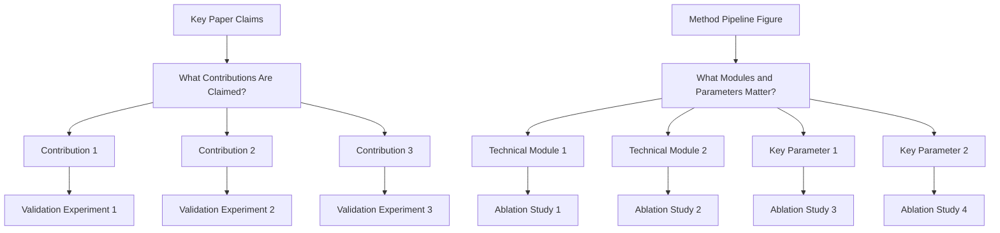
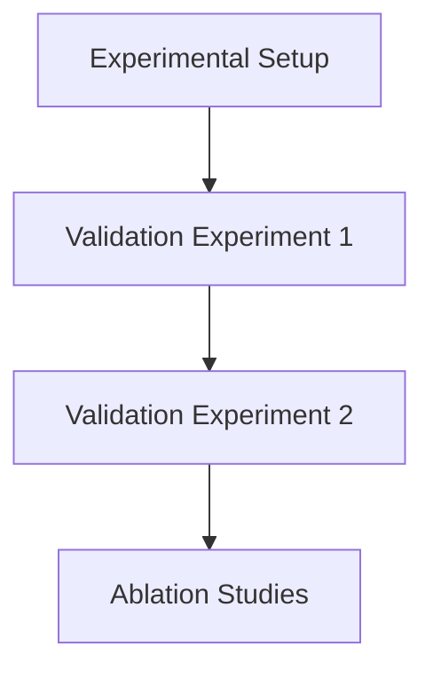

# Experiments Writing Guide

## Goal

Convince reviewers with complete evidence on effectiveness, causality, and practical value.

## Three Core Questions

1. Is the method better than strong baselines?
   - Run comparison experiments against strong and recent baselines.
   - Report standard metrics on the main benchmark(s).
   - Include SOTA or strongest public methods, not only weak baselines.
   - Keep protocol fair (same data split, preprocessing, and evaluation settings).
2. Which modules/design choices make the gain?
   - Run ablation studies for each key module/design choice.
   - Use remove/replace/disable variants and report delta to full model.
   - Include component interaction ablations when modules are coupled.
3. How far can the method generalize under harder settings?
   - Run demos/evaluations on harder or out-of-distribution settings.
   - Add stress-test scenarios (more complex scenes, rarer cases, noisier inputs, or stricter constraints).
   - Report both gains and failure modes to show realistic boundaries.

## Experiment Planning

## Experiment Section Decomposition

## Figure/Table Writing Rules

`Good tables are part of experiment communication quality, not decoration.`

1. Figure captions and table captions are equally important in the writing quality of Experiments.

### Hard rules

1. Put caption above the table.
2. Avoid vertical lines (`|`) in tabular columns.
3. Do not use double rules or dense `\hline` stacks.
4. Use `booktabs` style (`\toprule`, `\midrule`, `\bottomrule`) for clean structure.
5. Use as few horizontal rules as possible; lines should separate groups, not every row.
6. Highlight key numbers (best/second-best or target rows) with subtle color emphasis.

### Readability rules from review practice

1. Label metric direction in column headers (for example `PSNR ↑`, `LPIPS ↓`).
2. Add units when needed so values are interpretable without guessing.
3. Align text columns left; keep numeric columns consistently aligned.
4. Keep numeric precision consistent (same decimal places within a metric column).
5. Group multi-dataset or multi-setting results using `\multicolumn` + `\cmidrule`, not vertical separators.
6. One table, one message: do not mix unrelated results in a single table.
7. If rows represent different attributes/ablations, encode that explicitly in row names or attribute columns.
8. Keep caption focused on setting/protocol/notation, not long discussion.
9. If there is little detail to explain, use one concise sentence to summarize the main result.
10. For single-column figures/tables in two-column papers, prefer placing them in the right column when layout allows, so readers can enter the page from the left-top text without breaking reading flow.

### Minimal LaTeX checklist

1. Add packages in preamble: `\usepackage{booktabs}`, `\usepackage{colortbl,xcolor}` (and optionally `\usepackage{siunitx}` for decimal alignment).
2. Replace `\hline`-heavy style with `\toprule/\midrule/\bottomrule`.
3. Put `\caption{...}` before `\label{...}` and keep caption above.
4. Use restrained highlighting; never color too many cells.

## Recommended Ablation Package

1. One core ablation table for all major contributions.
2. Several focused mini-ablations for module-level design choices.
3. Matching qualitative visual results for each important ablation.

## Experimental Rigor Checklist

1. Are baselines recent and relevant?
2. Are metrics sufficient and standard for this task?
3. Is ablation tied to every key design claim?
4. Are claims in Abstract/Introduction supported by reported numbers?
5. Are limitations of evaluation scope explicitly stated?
