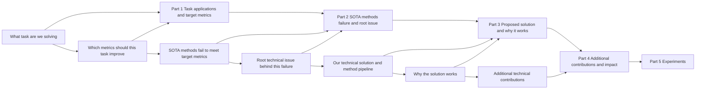

# Introduction Writing Guide

## Goal

Write a strong introduction in three steps:

1. Think through the introduction logic.
2. Apply a suitable template below.
3. Revise the introduction repeatedly.

## Introduction Logic Map



## How to Think About Introduction: Backward First, Then Forward

### Backward reasoning (answer these first)

1. What technical problem do we solve, and why is there no well-established solution? (important)
2. What are the contributions of our pipeline (e.g., a new valuable task, a new valuable metric, a new technical problem, or a new technique)?
3. What are the benefits of our contributions, why can they solve this technical challenge, and what new insight do they bring? (important)
4. How do we use prior methods to lead readers to our solved challenge and our new insight?

### Forward story (write in this order)

1. Introduce the paper's task.
2. Use prior methods to lead to the technical challenge we solve.
3. Present xx contributions to solve this technical challenge.
4. Explain technical advantages of our contributions and explicitly express our new insight. (important)

## Section Skeleton

```latex
\section{Introduction}
% Task and application
% Technical challenge for previous methods (discuss around the technical challenge that we solved. A technical challenge includes both limitation and technical reason)
% Introduce our pipeline for solving the challenge
% Experiment
% Contributions
```

## Part A: Introduce Task and Application

### Version 1

`Version 1: If the task is relatively niche, introduce the task first, then introduce applications.`

Writing structure:

1. Define the task in one clear sentence (`what output` from `what input`).
2. Briefly explain the task objective or scope (optional).
3. Introduce application value with 2-3 representative scenarios.

Sentence skeleton:

1. `[xxx task] targets at recovering/reconstructing/estimating [xxx output] from [xxx input].`
2. `[xxx task] has a variety of applications such as [xxx], [xxx], and [xxx].`

Local cite:

1. `references/examples/introduction/version-1-task-then-application.md`

### Version 2

`Version 2: If the task is already familiar to most readers, introduce applications directly.`

Writing structure:

1. Skip formal task definition.
2. Open with application importance in one concise sentence.
3. Optionally append target requirement (e.g., accuracy/efficiency/robustness).

Sentence skeleton:

1. `[xxx task] has a variety of applications such as [xxx], [xxx], and [xxx].`

Local cite:

1. `references/examples/introduction/version-2-application-first.md`

### Version 3

`Version 3: Introduce applications of the general task first, then introduce the specific task setting. (Personally recommended when the setting is relatively new.)`

Writing structure:

1. Start from the general task and why it matters.
2. Narrow down to the specific setting of this paper.
3. Clarify exact input/output and boundary of the setting.

Sentence skeleton:

1. `[general task] has a variety of applications such as [xxx], [xxx], and [xxx].`
2. `This paper focuses on the specific setting of recovering/reconstructing/estimating [xxx output] from [xxx input].`

Local cite:

1. `references/examples/introduction/version-3-general-to-specific-setting.md`

### Version 4

`Version 4: If the task is familiar, introduce applications directly and expose the target technical challenge in the opening paragraph via previous methods (failure cases / target metric improvements).`

Writing structure:

1. Start with task/application importance.
2. Immediately summarize how representative previous methods work.
3. Immediately expose the unresolved failure case + technical reason.
4. Use this opening as a bridge to the later prior-work paragraphs.

Opening-paragraph skeleton:

1. `[Task/application importance sentence].`
2. `Given input ..., previous methods usually ...`
3. `Although they work in many cases, they fail at ... because ...`

Expert note:

1. It is often good if the first paragraph already states what problem you want to solve, instead of requiring several paragraphs of prior work before the challenge appears.
2. This style needs the right conditions and is less common.
3. Typical Version 4 flow: Part 1 (task + application and directly expose challenge via previous methods 1) -> Part 2 (previous methods 2 try to solve it but still fail) -> Part 3 (our method).
4. More common general flow: Part 1 (task + application) -> Part 2 (previous methods 1 + limitation) -> Part 3 (previous methods 2 + limitation; here the target challenge emerges) -> Part 4 (our method).

Local cite:

1. `references/examples/introduction/version-4-open-with-challenge.md`

## Part B: Introduce Technical Challenge for Previous Methods (Very Important)

Purpose:

1. Discuss around the exact technical challenge we solved.
2. Build reader curiosity about how to solve this challenge.
3. Make motivation/benefit of our method clear.

Key logic before writing (faithful translation):

1. First make clear the logic for "leading to the technical challenge we solved".
2. For existing tasks: identify which recent methods have this challenge, why those methods exist, and optionally what earlier challenge they were trying to solve.
3. For novel tasks: at minimum, define the technical challenge solved by our pipeline.

Important warning :

1. Do not first present a naive solution and then describe our improvement over it.
2. That writing makes the work look like a low-score incremental patch.
3. Even if the work is actually incremental, do not write it this way.
4. Why: this writing style can erase reader curiosity and make the idea look straightforward only because the writing hand-holds the reader.

### Technical-Challenge Version 1 (existing task, with existing methods)

`Version 1: For existing tasks, discuss the challenge chain from general challenge -> traditional methods -> recent methods -> remaining challenge that we solve.`

Writing structure:

1. Start with a general challenge statement for this task.
2. Briefly summarize traditional methods and their limitation.
3. Briefly summarize recent methods (1) and their limitation with technical reason.
4. Briefly summarize recent methods (2) and their limitation with technical reason.
5. Ensure the final limitation is exactly the challenge your method solves.

Sentence skeleton:

1. `This problem is particularly challenging due to ...`
2. `To overcome these challenges, traditional methods ... However, they ...`
3. `Recently, ... methods ... However, they ... because ...`
4. `To overcome this challenge, ... methods ... However, they ... because ...`

Local cite:

1. `references/examples/introduction/technical-challenge-version-1-existing-task.md`

### Technical-Challenge Version 2 (existing task + our insight seen in traditional methods)

`Version 2: For existing tasks, when our insight has historical roots in traditional methods, use that line as conceptual backing and then show why new methods still fail.`

Writing structure:

1. Start from mainstream methods and state their limitation.
2. Introduce a classical/traditional line that already contains insight similar to yours.
3. Explain why that classical line is still insufficient.
4. Return to modern methods and show the unresolved technical reason.
5. Bridge to your method naturally.

Sentence skeleton:

1. `Traditional/recent methods ... However, they ... because ...`
2. `To overcome this problem, a typical approach is [insight], which has long been explored ...`
3. `However, these methods still ... because ...`
4. `To overcome this challenge, newer methods ... However, they ... because ...`

Local cite:

1. `references/examples/introduction/technical-challenge-version-2-existing-task-insight-backed-by-traditional.md`

### Technical-Challenge Version 3 (novel task, no direct methods)

`Version 3: For novel tasks without direct prior methods, define the challenge directly and decompose it into several concrete challenge points.`

Writing structure:

1. State the goal and explain that the problem is challenging for N reasons.
2. Use `First/Second/Finally` to separate independent challenge points.
3. For each point, state the observable limitation and the technical reason.
4. End with a transition to your pipeline.

Sentence skeleton:

1. `In this work, our goal is to ... This problem is challenging for three reasons.`
2. `First, ...`
3. `Second, ...`
4. `Finally, ...`

Local cite:

1. `references/examples/introduction/technical-challenge-version-3-novel-task.md`

## Part C: Introduce Our Pipeline for Solving the Challenge

Key questions before writing:

### For existing tasks

1. What technical challenge does our pipeline solve?
2. What is our technical contribution?
3. Why can our method work in essence?
4. What benefits does our method have over previous methods?

### For novel tasks

1. What technical challenge does our pipeline solve?
2. What is our technical contribution?
3. Why can our method work in essence?

### Pipeline Version 1

`Version 1: One contribution with multiple advantages, and one teaser figure to present the basic idea.`

Writing structure:

1. Introduce one core framework/representation for the target task.
2. Point to teaser figure for the basic idea.
3. State key novelty in one sentence.
4. Explain concrete implementation steps (`Specifically, ...`).
5. State multiple advantages (`In contrast ...`, `Another advantage ...`).

Sentence skeleton:

1. `In this paper, we propose a novel framework/representation, named ..., for ...`
2. `The basic idea is illustrated in Figure ...`
3. `Our innovation is in ...`
4. `Specifically, ...`
5. `In contrast to previous methods, ...`
6. `Another advantage of the proposed method is that ...`

Local cite:

1. `references/examples/introduction/pipeline-version-1-one-contribution-multi-advantages.md`

### Pipeline Version 2

`Version 2: Two contributions, and one teaser figure to present the basic idea.`

Writing structure:

1. Introduce framework and key novelty sentence.
2. Point to teaser figure.
3. Explain contribution 1 and its advantage.
4. Introduce a remaining challenge.
5. Explain contribution 2 as the response to that challenge.

Sentence skeleton:

1. `In this paper, we propose ...`
2. `Our innovation is in ...`
3. `The basic idea is illustrated in Figure ...`
4. `Specifically, ...` (contribution 1)
5. `In contrast to previous methods, ...`
6. `However, ...` (remaining challenge)
7. `Specifically, ...` (contribution 2)

Local cite:

1. `references/examples/introduction/pipeline-version-2-two-contributions.md`

### Pipeline Version 3

`Version 3: Build on a prior pipeline and introduce one new module, with a teaser figure for the basic idea.`

Writing structure:

1. Start from prior pipeline setup.
2. Introduce one new module as key innovation.
3. Provide an observation that motivates the module design.
4. Explain the module mechanism.
5. Compare against generic alternatives and state why it is better.

Sentence skeleton:

1. `Inspired by previous methods, ...`
2. `Our innovation is introducing ...`
3. `We observe that ...`
4. `Considering that ..., we introduce ...`
5. `In contrast to ..., our module ...`

Local cite:

1. `references/examples/introduction/pipeline-version-3-new-module-on-existing-pipeline.md`

### Pipeline Version 4

`Version 4: Contribution comes from one important observation. Introduce key innovation first, then a listener-friendly observation as motivation, then method details, then benefits.`

Writing structure:

1. State key innovation first.
2. State one intuitive observation as motivation.
3. Explain implementation details.
4. Explain technical advantage and empirical gain.

Sentence skeleton:

1. `Our innovation is ...`
2. `We observe that ...`
3. `Considering that ..., we ...`
4. `This leads to ... and achieves ...`

Local cite:

1. `references/examples/introduction/pipeline-version-4-observation-driven.md`

### Not Recommended Writing

`Not recommended: If the method is simple, do not hide concrete method design in Introduction and only describe abstract insights to make the work look novel.`

Expert note:

1. In this template, the writing craft is about making a simple pipeline sound novel.
2. The key caution: people often make the pipeline steps sound novel, not the real insight.
3. In most cases this is not recommended. The better target is to clearly explain core contribution implementation in Introduction.

Why not recommended (writing structure warning):

1. Presenting only abstract insight without concrete pipeline steps weakens technical clarity.
2. Introducing many new terms without mechanism-level explanation creates a novelty illusion.
3. Reviewers may interpret this as shallow or incremental work.

Local cite:

1. `references/examples/introduction/pipeline-not-recommended-abstract-only.md`

## Example Bank

1. `references/examples/introduction-examples.md`
2. `references/examples/introduction/version-1-task-then-application.md`
3. `references/examples/introduction/version-2-application-first.md`
4. `references/examples/introduction/version-3-general-to-specific-setting.md`
5. `references/examples/introduction/version-4-open-with-challenge.md`
6. `references/examples/introduction/technical-challenge-version-1-existing-task.md`
7. `references/examples/introduction/technical-challenge-version-2-existing-task-insight-backed-by-traditional.md`
8. `references/examples/introduction/technical-challenge-version-3-novel-task.md`
9. `references/examples/introduction/pipeline-version-1-one-contribution-multi-advantages.md`
10. `references/examples/introduction/pipeline-version-2-two-contributions.md`
11. `references/examples/introduction/pipeline-version-3-new-module-on-existing-pipeline.md`
12. `references/examples/introduction/pipeline-version-4-observation-driven.md`
13. `references/examples/introduction/pipeline-not-recommended-abstract-only.md`

## Quick Quality Checklist

1. Does the first sentence of each paragraph state its message?
2. Does each paragraph carry one message only?
3. Are technical challenge, technical reason, and solved mechanism all explicit?
4. Are claims in Introduction aligned with experiment evidence?
5. Is terminology stable across all sections?
