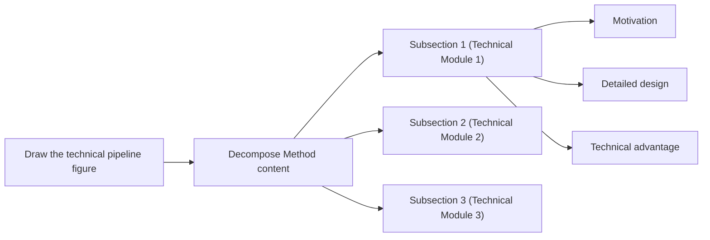
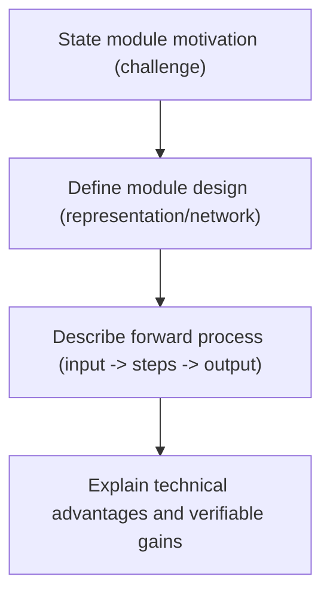

# Method Writing Guide

## Goal

Write the Method section clearly by following this sequence:

1. Answer key method-design questions.
2. Draw a pipeline figure sketch.
3. Write the method section step by step.

## Pre-Writing Questions

`Before writing Method, first answer: (1) what modules exist in the method, and (2) for each module, what is the workflow, why this module is needed, and why this module works.`

Recommended organization:

1. List all modules in the pipeline.
2. For each module, answer three questions:

- How does the module run?
- Why do we need this module?
- Why does this module work?

3. Organize answers as a mind map or a table for clarity.

## Method Writing Steps

`Method writing steps: (1) draw pipeline figure sketch, (2) map subsections from the sketch, (3) plan each subsection with motivation/design/advantages, (4) write module design first, (5) then add motivation and technical advantages.`

Step-by-step workflow:

1. Draw the pipeline figure sketch.
2. Use the sketch to organize Method subsection structure.
3. For each subsection, plan three parts: motivation, module design, and technical advantages.
4. Write module design first to build a concrete backbone.
5. Add motivation and technical advantages afterward.

## Three Elements of a Pipeline Module

`A pipeline module has three elements: Module design, Motivation of this module, and Technical advantages of this module.`

### 1) Module Design

Definition:

1. Describe representation/network/data-structure details.
2. Describe the forward process clearly: given input -> step 1 -> step 2 -> step 3 -> output.

### 2) Motivation of This Module

Definition:

1. Explain why this module is needed.
2. Use problem-driven logic: because problem X exists, we design module Y.

### 3) Technical Advantages of This Module

Definition:

1. Explain why this module has technical advantage over alternatives.
2. Tie advantage to measurable behavior when possible.

### Example of the Three Elements

Local cite:

1. `references/examples/method/example-of-the-three-elements.md`

## Method Content Decomposition



## How to Write Module Design

`Module design usually has two parts: (1) describe specific data/network structures, and (2) describe forward process as input -> steps -> output.`

Writing structure:

1. Define key structures first (representation, network, data structure).
2. Write forward process in strict execution order.
3. End with output interpretation or purpose.

Sentence skeleton:

1. `We represent ... with ...`
2. `Given [input], we first ... then ... finally ...`
3. `This produces [output], which is used for ...`

Local cite:

1. `references/examples/method/module-design-instant-ngp.md`

## How to Write Module Motivation

`Module motivation is usually problem-driven: because a problem exists, we design xx to solve it.`

Typical opening sentences:

1. `A remaining problem/challenge is ...`
2. `However, we ...`
3. `Previous methods have difficulty in ...`

Local cite:

1. `references/examples/method/module-motivation-patterns.md`

## How to Check Whether Method is Easy to Understand

`Check method clarity from three levels: writing logic, paragraph writing, and sentence writing.`

### 1) Logic-level check

1. After finishing the paper, summarize the Method writing logic again.
2. Check whether this summarized logic is smooth and easy to follow.

### 2) Paragraph-level check

1. The first sentence of each paragraph should make readers immediately understand what this paragraph is about.
2. One paragraph should clearly deliver one message.

### 3) Sentence-level check

1. Carefully check whether the **motivation** of each sentence is explicit. Keep one thing clear to readers at all times: **why this sentence content is needed**.
2. Carefully check sentence-to-sentence flow.
3. Carefully check term consistency and avoid changing key terms back and forth.

## Method Section Skeleton

```latex
\section{Method}
% Overview
% Section 3.1
% Section 3.2
% Section 3.3
```

Local cite:

1. `references/examples/method/section-skeleton.md`

## Overview Subsection

`Overview should usually include: setting, core contribution, optional pipeline figure pointer, and a map of what each subsection contains.`

Writing structure:

1. One to two sentences for task setting.
2. One to two sentences for core contribution.
3. If pipeline/framework is novel, point to overview figure.
4. Tell readers what Section 3.1/3.2/3.3 covers.

Local cite:

1. `references/examples/method/overview-template.md`

## Section 3.1 and Other Module Subsections

`Basic subsection logic: (1) motivation of this module, (2) module forward process/module design, (3) technical advantages of this module.`

Local cite:

1. `references/examples/method/example-of-the-three-elements.md`

## Module Writing Pattern (Mermaid)



## Implementation Details

`Implementation details include hyperparameters (e.g., layer count, feature dimensions), coordinate transforms/normalization, and other practical details. Put them near the end of Method or in a dedicated Implementation Details section.`

